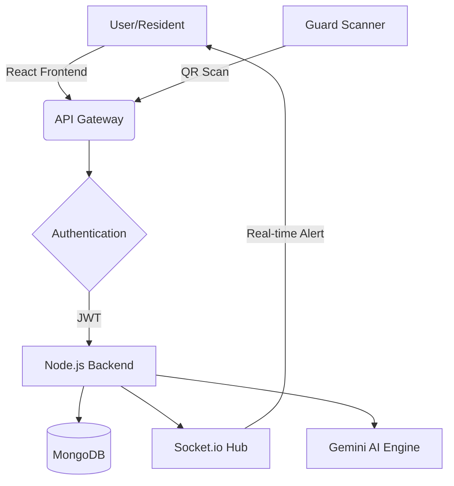

<p align="center">
  
</p>

<h1 align="center">🏎️ ParkSmart Pro</h1>

<p align="center">
  <strong>The Future of Autonomous Parking & Enterprise Visitor Management</strong>
</p>

<p align="center">
  <a href="https://www.figma.com/file/your-link"><strong>🎨 Figma Design</strong></a> ·
  <a href="https://parksmart-pro.vercel.app"><strong>🌐 Live Frontend</strong></a> ·
  <a href="https://parksmart-api.render.com"><strong>⚙️ Backend API</strong></a> ·
  <a href="https://documenter.getpostman.com/view/your-link"><strong>📄 Postman Docs</strong></a> ·
  <a href="https://youtube.com/demo-link"><strong>📺 YouTube Demo</strong></a>
</p>

<p align="center">
  
  
  
  
  
</p>

---

## 📖 About Project

**ParkSmart Pro** is a next-generation, enterprise-grade SaaS platform designed to revolutionize how residential societies and corporate hubs manage their parking ecosystems and visitor flows. By integrating **Neural AI verification**, **Real-time Spatial Tracking**, and **Automated QR Gateways**, we eliminate manual logging and security bottlenecks.

---

## ⚠️ Problem Statement

Traditional parking management suffers from:
*   **Security Gaps**: Manual visitor logs are easily forged and difficult to audit.
*   **Space Inefficiency**: Real-time occupancy data is rarely available, leading to wasted slots.
*   **Communication Lag**: Residents are often unaware when a guest arrives at the gate.
*   **Overstay Issues**: Vehicles exceeding their stay duration go unnoticed, causing congestion.

---

## ✅ The Solution

ParkSmart Pro provides a unified digital nervous system:
*   **Digital Passports**: Instant QR-based entry/exit passes.
*   **Live Digital Twin**: A real-time spatial map of every parking slot.
*   **Instant Sync**: Residents get real-time notifications via WebSockets.
*   **AI Analytics**: Predictive load balancing and overstay detection.

---

## 🚀 Core Features

| Feature | Description | Status |
| :--- | :--- | :--- |
| **QR Authentication** | Encrypted QR codes for seamless visitor entry/exit. | ✅ Live |
| **Interactive Map** | Real-time SVG-based spatial monitoring of all slots. | ✅ Live |
| **Multi-Role Auth** | Distinct dashboards for Admins, Guards, and Residents. | ✅ Live |
| **Analytics Engine** | Comprehensive data visualization for traffic and revenue. | ✅ Live |
| **AI Assistant** | Gemini-powered chatbot for facility management queries. | ✅ Live |

---

## 🧠 Advanced AI & Real-time Features

### 🤖 Neural AI (Gemini Integration)
Our AI engine doesn't just chat; it analyzes. 
*   **Predictive Occupancy**: Forecasts peak traffic hours based on historical data.
*   **Automated Audits**: Scans visitor logs to flag suspicious recurring entries.
*   **Facility NLP**: Allows admins to query "Which slot has the highest overstay rate?" in plain English.

### ⚡ Real-time Digital Twin (Socket.io)
*   **Instant Gate Sync**: When a guard scans a pass, the resident's dashboard updates in **<100ms**.
*   **Live Slot Status**: Visual indicators on the map change color the moment a vehicle enters a slot.

---

## 🛠 Tech Stack

### Frontend
*   **Framework**: React 18 (Vite)
*   **Styling**: Vanilla CSS + Tailwind CSS (Glassmorphism UI)
*   **Animation**: Framer Motion
*   **State Management**: React Context API

### Backend
*   **Runtime**: Node.js
*   **API**: Express.js (RESTful)
*   **Real-time**: Socket.io
*   **Auth**: JWT + Firebase Auth (OTP Support)

### Database & Cloud
*   **Primary DB**: MongoDB Atlas (Aggregations & Time-series)
*   **Secondary DB**: Firebase Firestore (Real-time Sync)
*   **Deployment**: Vercel (Frontend), Render (Backend)

---

## 🏗 System Architecture



---

## 📁 Folder Structure

```bash
parkQR/
├── backend/
│   ├── controllers/    # Business Logic
│   ├── models/         # Mongoose Schemas
│   ├── routes/         # API Endpoints
│   └── utils/          # Middleware & AI Helpers
├── frontend/
│   ├── src/
│   │   ├── components/ # Reusable UI
│   │   ├── context/    # Global State
│   │   ├── pages/      # View Layers
│   │   └── services/   # API Call Logic
└── README.md
```

---

## 🔌 API Documentation

### Visitor Pass Generation
`POST /api/v1/visitors`
```json
{
  "name": "John Doe",
  "vehicleNumber": "MH-12-AB-1234",
  "purpose": "Maintenance",
  "duration": 60
}
```

### QR Verification
`POST /api/v1/visitors/scan-qr`
```json
{
  "qrData": "TOKEN_STRING",
  "gateId": "GATE_01"
}
```

---

## 🔐 Security Features

*   **JWT Encryption**: State-of-the-art token-based session management.
*   **Rate Limiting**: Protection against DDoS and Brute Force on OTP endpoints.
*   **CORS Protection**: Restricted API access to authorized domains only.
*   **XSS Mitigation**: Sanitized inputs and content security policies.

---

## ⚡ Performance Optimization

*   **Code Splitting**: Lazy loading of dashboard modules to reduce initial TTI.
*   **Asset Compression**: WebP imagery and minified CSS/JS bundles.
*   **Database Indexing**: Optimized MongoDB queries for <50ms response times on analytics.
*   **Memoization**: Use of `useMemo` and `useCallback` to prevent redundant React re-renders.

---

## 📸 Screenshot Gallery

<p align="center">
  
  
</p>

---

## 🏁 Installation & Setup

### 1. Clone Repository
```bash
git clone https://github.com/vedantxy/parkQR.git
cd parkQR
```

### 2. Backend Setup
```bash
cd backend
npm install
# Configure .env with MONGO_URI, JWT_SECRET, GEMINI_API_KEY
npm run dev
```

### 3. Frontend Setup
```bash
cd frontend
npm install
npm run dev
```

---

## 📜 License

Distributed under the **MIT License**. See `LICENSE` for more information.

---

<p align="center">
  Made with ❤️ by <a href="https://github.com/vedantxy">Vedant</a>
</p>
