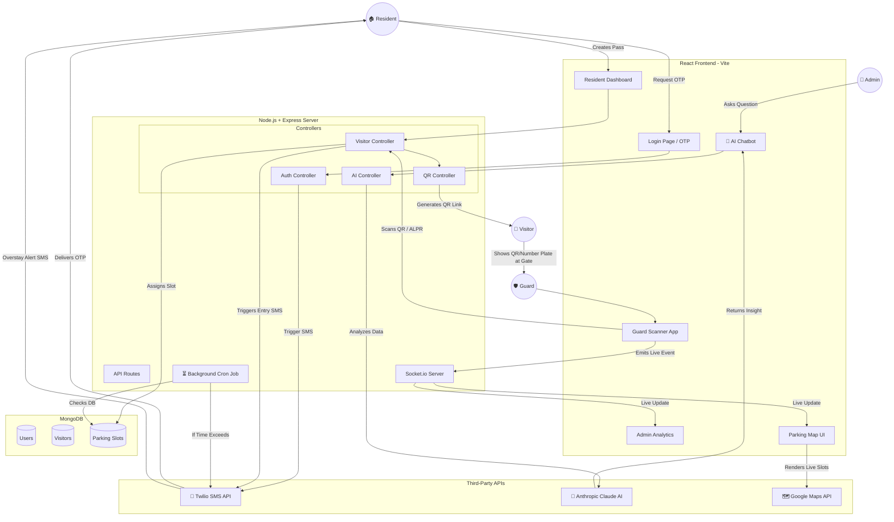

# 🅿️ ParkSmart AI — Enterprise-Grade Smart Parking & Visitor Management

ParkSmart AI is a production-ready, SaaS-level platform for residential societies, corporate campuses, and smart cities. It combines **real-time WebSocket automation**, **Firebase authentication**, **AI-powered parking allocation**, and **advanced analytics** into a single, premium dashboard experience.


---

## 🌟 Key Features

### 🔐 Authentication & Role-Based Access
- **Firebase Auth** — Secure email/password login with persistent sessions.
- **Role System** — `admin` and `guard` roles with filtered navigation & access controls.
- **JWT Tokens** — Backend-issued JWTs for API route protection via `authMiddleware`.

### 📡 Real-Time Security Engine
- **Socket.IO** — Live WebSocket connections for instant entry/exit alerts.
- **Overstay Detection** — Background cron (30 s interval) monitors visitors exceeding time limits.
- **Dynamic Toasts** — React Hot Toast notifications for instant feedback.

### 📊 Intelligent Analytics Center
- **Data Aggregation** — MongoDB aggregation pipelines for daily visitor trends.
- **4 Chart Types** — AreaChart, PieChart, BarChart, RadialBarChart via Recharts.
- **CSV Export** — Download analytics data on demand.

### 🛂 Smart Visitor Entry (QR-Based)
- **Instant Pass Generation** — QR-based entry tokens via `qrcode` library.
- **Unified Scan Flow** — Single `/scan-qr` endpoint handles both entry and exit.
- **Expiry & Reuse Prevention** — Strict validation on QR expiry and scan-state transitions.
- **Countdown Timer** — Live remaining-time display on generated passes.

### 🏗️ Fail-Safe Architecture
- **Intelligent Mock Mode** — Auto-switches to in-memory data store if MongoDB is offline.
- **Clean MVC Structure** — Controllers → Routes → Models separation for scalability.

### 🎨 Premium Light Theme UI
- **Design System** — Clean white cards, subtle shadows, soft borders (#E2E8F0).
- **Color Palette** — Primary Blue (#2563EB), Success Green (#10B981), Danger Red (#EF4444), Warning Amber (#F59E0B).
- **Typography** — Inter font (Google Fonts), 300–900 weights.
- **Collapsible Sidebar** — 240px expanded / 64px collapsed with blue active-border indicators.
- **Framer Motion** — Page transitions, modal animations, toast notifications.
- **Responsive** — Works on desktop and mobile.

---

## 🗺️ System Architecture



---

## 🛠️ Tech Stack

| Layer | Technology |
|---|---|
| **Frontend** | React 18, Vite 5, Tailwind CSS 3, Framer Motion, Recharts, Lucide Icons |
| **Backend** | Node.js, Express 5, Socket.IO 4, Morgan |
| **Database** | MongoDB (Mongoose 9) — with built-in mock fallback |
| **Auth** | Firebase Auth (client) + Firebase Admin SDK (server) + JWT |
| **QR Engine** | `qrcode` (generation) + `html5-qrcode` (camera scanning) |
| **Realtime** | Socket.IO (bi-directional WebSockets) |
| **AI/ML** | Anthropic Claude API (`@anthropic-ai/sdk`) — Chatbot, Risk Analysis, Summaries |
| **Notifications** | React Hot Toast |

---

## 🖥️ Pages (8 Total)

| # | Page | Component | Description |
|---|---|---|---|
| 1 | **Login** | `LoginPage` | Centered card, dot-pattern background, role quick-access buttons |
| 2 | **Dashboard** | `AdminPanel` | 4 stat cards, visitor trend chart, peak hours chart, recent table |
| 3 | **Visitor Entry** | `VisitorEntry` | Split form/QR layout, duration selector, VIP toggle, countdown |
| 4 | **Guard Scanner** | `GuardScanner` | Camera view, animated scan line, manual input fallback, recent scans |
| 5 | **Parking Map** | `BookingPage` | Filter bar, 4-column slot grid, overstay pulse, detail drawer |
| 6 | **Analytics** | `AnalyticsDashboard` | Date range picker, 4 KPIs, Area/Pie/Bar/Radial charts, CSV export |
| 7 | **Notifications** | `NotificationsPage` | Filter tabs, color-coded cards, mark read, delete, empty state |
| 8 | **Residents** | `UserDashboard` | Welcome card, active visitors, history table with search/pagination |

**Floating Component:**
| — | **AI Chatbot** | `AIChatbot` | Floating chat bubble, Claude-powered assistant, quick suggestions |

---

## 📂 Project Structure

```text
parkQR/
├── backend/
│   ├── config/
│   │   ├── db.js                  # MongoDB connection with mock-mode fallback
│   │   └── firebaseAdmin.js       # Firebase Admin SDK initialization
│   ├── controllers/
│   │   ├── analyticsController.js # Aggregation pipelines for KPI data
│   │   ├── notificationController.js # Overstay checks & alert engine
│   │   ├── parkingController.js   # Slot CRUD & availability logic
│   │   ├── qrController.js        # QR generation & scan verification
│   │   ├── userController.js      # User registration & login
│   │   └── visitorController.js   # Visitor lifecycle (create → entry → exit)
│   ├── middleware/
│   │   └── authMiddleware.js      # JWT + Firebase token verification
│   ├── models/
│   │   ├── Notification.js        # Alert schema
│   │   ├── ParkingSlot.js         # Slot schema (type, status, floor)
│   │   ├── QRPass.js              # QR pass schema (token, expiry)
│   │   ├── User.js                # User schema (name, email, role)
│   │   └── Visitor.js             # Visitor schema (status lifecycle)
│   ├── routes/
│   │   ├── analyticsRoutes.js     # GET /api/analytics/*
│   │   ├── notificationRoutes.js  # GET/POST /api/notifications/*
│   │   ├── parkingRoutes.js       # GET/POST /api/parking/*
│   │   ├── qrRoutes.js           # POST /api/qr/*
│   │   ├── userRoutes.js          # POST /api/users/*
│   │   └── visitorRoutes.js       # GET/POST /api/visitors/*
│   ├── scripts/
│   │   ├── seedFirestore.js       # Seed Firestore with initial data
│   │   └── seedParkingSlots.js    # Seed MongoDB parking slots
│   ├── utils/
│   │   ├── firebaseSync.js        # Firebase ↔ MongoDB sync helpers
│   │   ├── generateToken.js       # JWT token generation utility
│   │   ├── mockData.js            # In-memory data store (mock mode)
│   │   └── qrService.js           # QR code generation logic
│   ├── seedParking.js             # Quick-seed script for parking slots
│   ├── server.js                  # Express + Socket.IO HTTP server entry point
│   ├── package.json
│   └── .env                       # PORT, MONGODB_URI, JWT_SECRET, NODE_ENV
│
├── frontend/
│   ├── src/
│   │   ├── components/
│   │   │   ├── AppLayout.jsx           # Sidebar + header layout wrapper
│   │   │   ├── AnalyticsDashboard.jsx  # (legacy) Charts component
│   │   │   ├── NotificationBell.jsx    # Header notification icon
│   │   │   ├── NotificationList.jsx    # Alert feed panel
│   │   │   ├── ParkingGrid.jsx         # Visual parking slot grid
│   │   │   ├── QRModal.jsx             # QR code display modal
│   │   │   └── VisitorForm.jsx         # Visitor registration form
│   │   ├── context/
│   │   │   └── AuthContext.jsx         # Firebase Auth provider + role state
│   │   ├── pages/
│   │   │   ├── AdminPanel.jsx          # Dashboard with stats, charts, table
│   │   │   ├── AnalyticsDashboard.jsx  # Full analytics page (4 charts)
│   │   │   ├── BookingPage.jsx         # Parking slot grid with filter/drawer
│   │   │   ├── Dashboard.jsx           # General dashboard view
│   │   │   ├── GuardScanner.jsx        # QR camera scanner terminal
│   │   │   ├── LoginPage.jsx           # Firebase login page (light theme)
│   │   │   ├── NotificationsPage.jsx   # Notification center
│   │   │   ├── ParkingHome.jsx         # Parking landing page
│   │   │   ├── SpotListing.jsx         # Available spots list
│   │   │   ├── UserDashboard.jsx       # Resident dashboard
│   │   │   └── VisitorEntry.jsx        # Visitor registration + QR generation
│   │   ├── services/
│   │   │   ├── bookingService.js       # Firestore booking CRUD
│   │   │   └── parkingService.js       # Firestore parking listener
│   │   ├── utils/
│   │   │   ├── seedSlots.js            # Client-side slot seeding
│   │   │   └── socket.js              # Socket.IO client instance
│   │   ├── App.jsx                     # Root app — routing + toast provider
│   │   ├── firebase.js                 # Firebase client SDK config
│   │   ├── index.css                   # Global styles + Inter font
│   │   └── main.jsx                    # React DOM entry point
│   ├── .env                            # VITE_FIREBASE_* config keys
│   ├── tailwind.config.js              # Design system tokens
│   ├── postcss.config.js
│   └── package.json
│
├── docs/                               # Project documentation
└── README.md                           # ← You are here
```

---

## 🚀 Getting Started

### 1. Prerequisites
- **Node.js** v16+
- **MongoDB** (optional — system auto-switches to Mock Mode if unavailable)

### 2. Installation

```bash
# Clone the repository
git clone <repo-url>
cd parkQR

# Install Backend Dependencies
cd backend
npm install

# Install Frontend Dependencies
cd ../frontend
npm install
```

### 3. Environment Variables

**Backend** (`backend/.env`):
```env
PORT=5000
MONGODB_URI=mongodb://127.0.0.1:27017/smart_parking
JWT_SECRET=your_jwt_secret_here
NODE_ENV=development
```

**Frontend** (`frontend/.env`):
```env
VITE_FIREBASE_API_KEY=your_key
VITE_FIREBASE_AUTH_DOMAIN=your_project.firebaseapp.com
VITE_FIREBASE_PROJECT_ID=your_project_id
VITE_FIREBASE_STORAGE_BUCKET=your_project.firebasestorage.app
VITE_FIREBASE_MESSAGING_SENDER_ID=your_sender_id
VITE_FIREBASE_APP_ID=your_app_id
VITE_GOOGLE_MAPS_KEY=your_google_maps_api_key
```

### 4. Running the System

```bash
# Terminal 1 — Start Backend (Port 5000)
cd backend
node server.js

# Terminal 2 — Start Frontend (Port 5173)
cd frontend
npm run dev
```

### 5. Seed Data (Optional)

```bash
# Populate parking slots in MongoDB
node backend/seedParking.js

# Seed Firestore data
node backend/scripts/seedFirestore.js

# Seed parking slots via script
node backend/scripts/seedParkingSlots.js
```

---

## 🔌 API Endpoints

| Method | Endpoint | Description |
|--------|----------|-------------|
| `POST` | `/api/users/register` | Register a new user |
| `POST` | `/api/users/login` | Authenticate & get JWT |
| `GET` | `/api/parking/slots` | List all parking slots |
| `POST` | `/api/parking/book` | Book a parking slot |
| `POST` | `/api/visitors/add` | Register a new visitor |
| `GET` | `/api/visitors/list` | Get all visitors |
| `POST` | `/api/qr/scan-qr` | Unified QR scan (entry/exit) |
| `POST` | `/api/qr/generate` | Generate a QR pass |
| `GET` | `/api/analytics/dashboard` | Get analytics KPIs |
| `GET` | `/api/notifications` | Fetch notifications |
| `POST` | `/api/notifications/read` | Mark notifications as read |
| `POST` | `/api/ai/ask` | Chat with AI Assistant |
| `GET` | `/api/ai/analyze/:visitorId` | AI Risk Analysis |
| `GET` | `/api/ai/summary` | AI Daily Summary |

---

## 🎨 Design System

| Token | Value |
|-------|-------|
| Primary | `#2563EB` (Blue) |
| Success | `#10B981` (Green) |
| Danger | `#EF4444` (Red) |
| Warning | `#F59E0B` (Amber) |
| Background | `#F8FAFC` |
| Card | `#FFFFFF` |
| Text Primary | `#0F172A` |
| Text Secondary | `#64748B` |
| Border | `#E2E8F0` |
| Font | Inter (Google Fonts) |
| Card Radius | 12px |
| Button Radius | 8px |

---

## 📜 License

This project is licensed under the **MIT License**.
